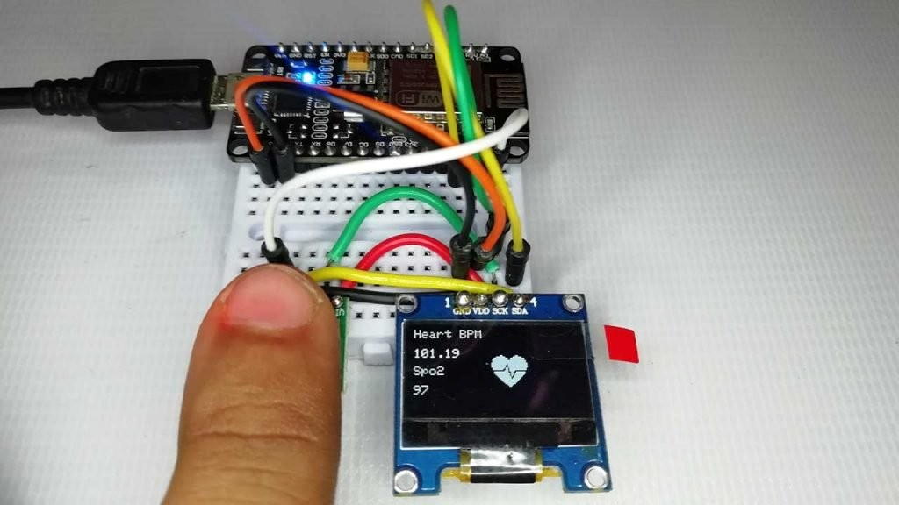
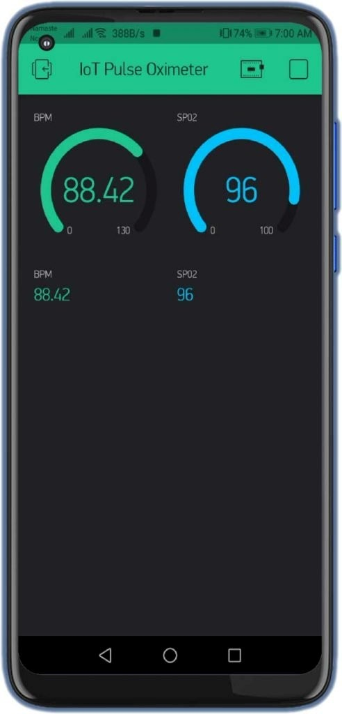
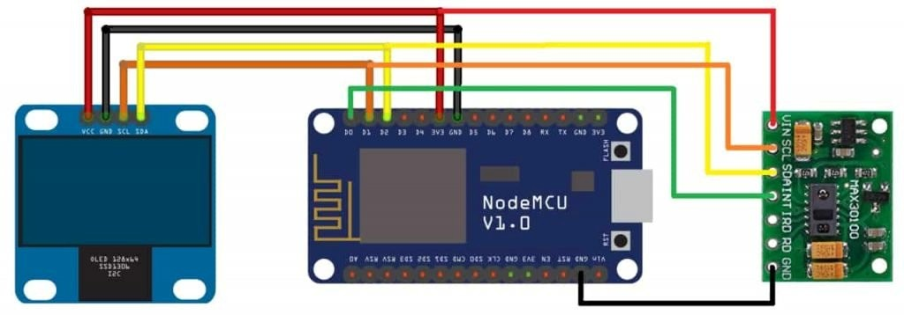

# 💓 Heartbeat Monitoring System using ESP8266 & MAX30100

An IoT-based real-time system to measure heart rate (BPM) and SpO₂ using the NodeMCU ESP8266 microcontroller and MAX30100 pulse oximeter. The system displays values on an OLED screen and sends data to the Blynk mobile app via Wi-Fi.

---

## 📦 Project Contents
- `HEARTBEAT.ino` — Arduino code for ESP8266
- `Heartbeat monitoring report.pdf` — Complete project report (IEEE-style)
- `out1.jpg`, `out2.jpg` — OLED & Blynk app screenshots
- `schematic.jpg` — Wiring circuit diagram

---

## 🔧 Hardware Used
- NodeMCU ESP8266 (Wi-Fi enabled microcontroller)
- MAX30100 Pulse Oximeter Sensor
- 128x64 OLED Display (I2C)
- Power Supply (USB/power bank)
- Smartphone with Blynk App installed

---

## 🛠️ Software & Libraries
- **Arduino IDE**
- Required libraries:
  - `Wire.h`
  - `Adafruit_SSD1306.h`
  - `MAX30100_PulseOximeter.h`
  - `BlynkSimpleEsp8266.h`
- **Blynk IoT Platform**
  - Virtual Pin `V1`: Heart Rate
  - Virtual Pin `V2`: SpO2

---

## 📈 Accuracy & Testing
- **Heart Rate Accuracy**: ±2 BPM compared to commercial devices
- **SpO₂ Accuracy**: ±2%
- **Latency**: 2–3 seconds from sensor to mobile app
- **Battery Life**: ~5 hours with power bank

---

## 🧠 Key Learnings
- Correct I2C pin mapping for MAX30100 & OLED on ESP8266
- Real-time data syncing with Blynk via Auth Token
- Common pitfalls like unstable power, incorrect sensor positioning, etc.

---

## 🖼️ Snapshots

| OLED Display Reading | Blynk App UI | Circuit Diagram |
|----------------------|--------------|-----------------|
|   |  |  |

---

## 👤 Authors
- **Digvijay Saste** – COEP Technological University  
- **Saurav Satpute** – COEP Technological University

---

## 📄 Report
📘 Download the full project report here:  
[Heartbeat Monitoring Report (PDF)](./Heartbeat%20monitoring%20report.pdf)

---

## 📜 License
MIT License – You are free to reuse and modify this project with attribution.
